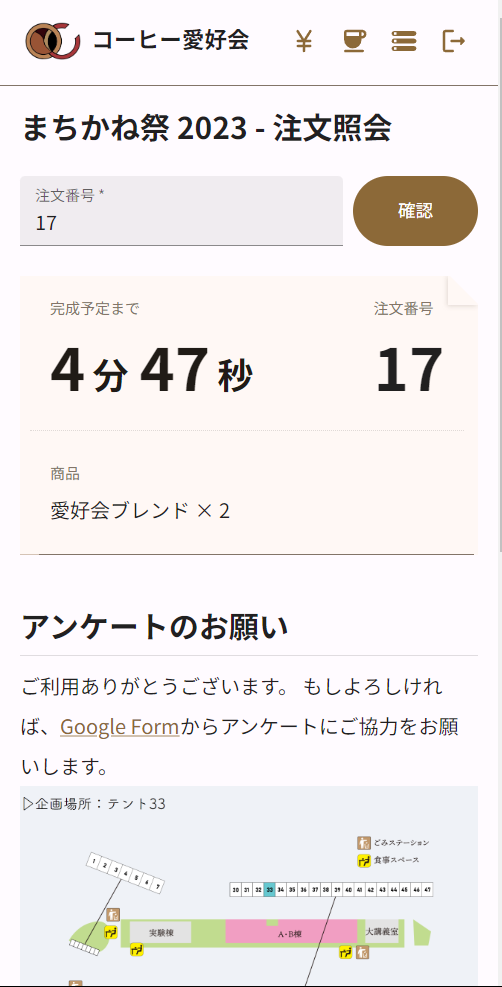
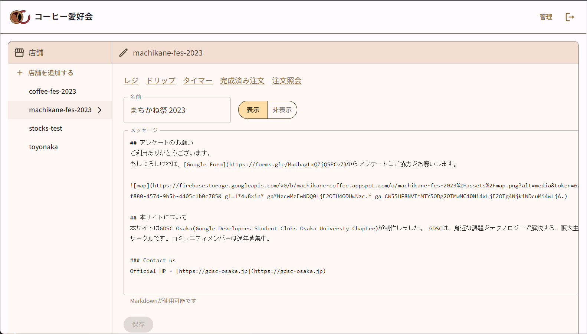
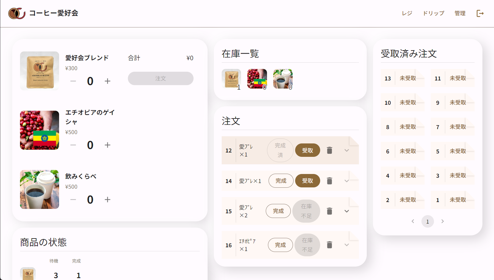
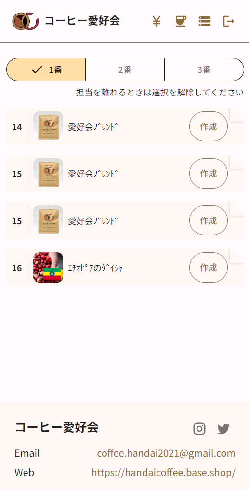

# [machikane-coffee](https://machikane-coffee.web.app)
[machikane-coffee](https://machikane-coffee.web.app)は[コーヒー愛好会](https://twitter.com/coffee_handai)のための会計/待ち時間管理アプリです。

## DEMO
<div style="display: grid; grid-template-areas: 'a b c' 'a b d'; grid-template-columns: 1fr 1fr 1.65fr; gap: 5px"> 
  <a target="_blank" href="https://machikane-coffee.web.app/machikane-fes-2023" style="grid-area: a">
    
  </a>
  <a target="_blank" href="https://machikane-coffee.web.app/admin" style="grid-area: c">
    
  </a>
  <a target="_blank" href="https://machikane-coffee.web.app/machikane-fes-2023/admin" style="grid-area: d">
    
  </a>
  <a target="_blank" href="https://machikane-coffee.web.app/machikane-fes-2023/admin/barista" style="grid-area: b">
    
  </a>
</div>

## 設計
構成: MUI, Redux, [Firebase](https://console.firebase.google.com/u/0/project/machikane-coffee), [Figma](https://www.figma.com/file/t1CliOwgX3QIBFXgKdzFqI/Machikane-Coffee?type=design&node-id=11%3A1833&mode=design&t=OLwGYranCLwX94z9-1) 等

### ディレクトリ構成
`/src/components/`: 汎用的なコンポーネント  
`/src/components/<foo>/`: 機能に特化したコンポーネント  
`/src/modules`: ロジックに関わる関数群  
`/src/pages/`: 各ページのコンポーネント

### DB
DB操作はほぼ全てフロントのReduxの担当です。
例外的に、0時の一部ドキュメントリセットは Firebase Functions から実行しています。

注文に関わるロジックは [#123](https://github.com/gdsc-osaka/machikane-coffee/issues/123) を参照してください。
```yaml
shops:
  - foo_shop:
    - orders:
        - foo_order
        - bar_order
    - products:
        - foo_product 
        - bar_product 
    - stocks:
        - foo_stock
        - bar_stock
```
